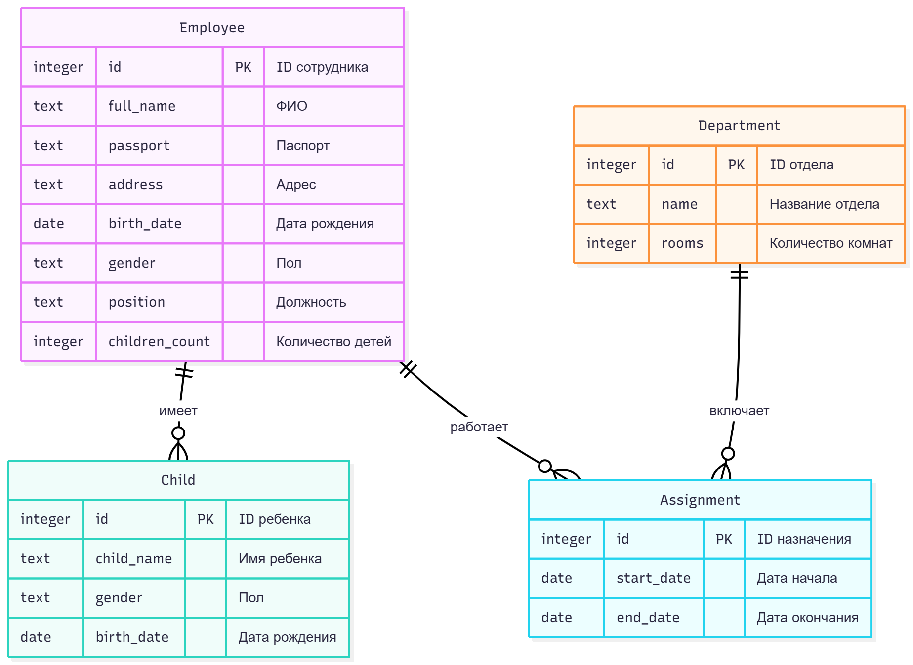
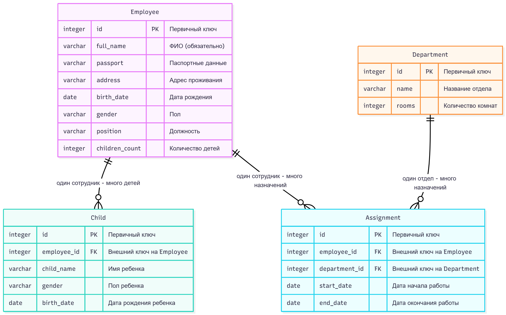
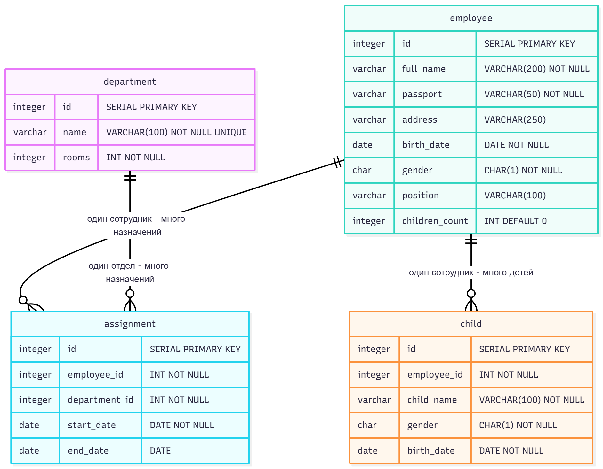

# Отчет по проектированию информационной модели для реляционной БД «Отдел кадров»

## Содержание
1. [Постановка задачи](#постановка-задачи)
2. [Концептуальная модель (ER)](#концептуальная-модель-er)
3. [Логическая модель](#логическая-модель)
4. [Физическая модель](#физическая-модель)
5. [SQL DDL](#sql-ddl)
6. [Примеры запросов и выходных документов](#примеры-запросов-и-выходных-документов)
7. [Проверка нормальных форм](#проверка-нормальных-форм)
8. [Эволюция проекта](#эволюция-проекта)
9. [Итог](#итог)

---

# Постановка задачи

### Цель проекта
Создать реляционную базу данных для учета сотрудников, их детей и истории работы сотрудников в различных отделах предприятия.

### Сущности
- **Сотрудники**: табельный номер, ФИО, паспортные данные, адрес, дата рождения, пол, должность, количество детей.
- **Дети сотрудников**: имя, пол, дата рождения.
- **Отделы**: наименование, количество закреплённых помещений.
- **Назначения (история работы)**: сотрудник → отдел, дата начала, дата окончания.

### Процессы
- Каждый сотрудник работает только в одном отделе в каждый момент времени.
- Необходимо вести полную хронологию назначений.
- Даты периодов **не должны пересекаться** — требует реализации триггера.

### Выходные документы
1. Список работников заданного отдела на указанную дату, упорядоченный по возрасту.
2. Список сотрудников, имеющих более одного ребенка, сгруппированный по отделам, с подсчётом **среднего возраста сотрудников**.

---

# Концептуальная модель (ER)



---

# Логическая модель


# Физическая модель



### Таблица сотрудников
- `id SERIAL PK`
- `birth_date DATE NOT NULL`
- индексы по ФИО и дате рождения

### Таблица детей
- внешний ключ `employee_id REFERENCES employee(id)`

### Таблица отделов
- имя уникально

### Таблица назначений
- `start_date < end_date`
- **Триггер предотвращает пересечение периодов**

---

# SQL DDL

```sql
CREATE TABLE department (
    id SERIAL PRIMARY KEY,
    name VARCHAR(100) NOT NULL UNIQUE,
    rooms INTEGER NOT NULL
);

CREATE TABLE employee (
    id SERIAL PRIMARY KEY,
    full_name VARCHAR(200) NOT NULL,
    passport VARCHAR(50) NOT NULL,
    address VARCHAR(250),
    birth_date DATE NOT NULL,
    gender CHAR(1) NOT NULL,
    position VARCHAR(100),
    children_count INTEGER DEFAULT 0
);

CREATE TABLE child (
    id SERIAL PRIMARY KEY,
    employee_id INTEGER NOT NULL REFERENCES employee(id) ON DELETE CASCADE,
    child_name VARCHAR(100) NOT NULL,
    gender CHAR(1) NOT NULL,
    birth_date DATE NOT NULL
);

CREATE TABLE assignment (
    id SERIAL PRIMARY KEY,
    employee_id INTEGER NOT NULL REFERENCES employee(id) ON DELETE CASCADE,
    department_id INTEGER NOT NULL REFERENCES department(id) ON DELETE CASCADE,
    start_date DATE NOT NULL,
    end_date DATE,
    CHECK (end_date IS NULL OR end_date > start_date)
);
```

### Индексы

```sql
CREATE INDEX idx_emp_birth ON employee(birth_date);
CREATE INDEX idx_assign_emp ON assignment(employee_id);
CREATE INDEX idx_assign_dept ON assignment(department_id);
```

### Триггер предотвращающий пересечение периодов

```sql
CREATE OR REPLACE FUNCTION check_assignment_overlap()
RETURNS TRIGGER AS $$
BEGIN
    IF EXISTS (
        SELECT 1
        FROM assignment a
        WHERE a.employee_id = NEW.employee_id
          AND (NEW.end_date IS NULL OR a.start_date <= NEW.end_date)
          AND (a.end_date IS NULL OR a.end_date >= NEW.start_date)
          AND a.id <> NEW.id
    ) THEN
        RAISE EXCEPTION 'Пересечение периодов работы сотрудника';
    END IF;
    RETURN NEW;
END;
$$ LANGUAGE plpgsql;

CREATE TRIGGER trg_assignment_overlap
BEFORE INSERT OR UPDATE ON assignment
FOR EACH ROW EXECUTE FUNCTION check_assignment_overlap();
```

---

# Примеры запросов и выходных документов

## 1. Список работников отдела на дату

```sql
SELECT e.full_name,
       e.birth_date,
       e.position,
       d.name AS department
FROM employee e
JOIN assignment a ON a.employee_id = e.id
JOIN department d ON d.id = a.department_id
WHERE d.name = :dept_name
  AND a.start_date <= :the_date
  AND (a.end_date IS NULL OR a.end_date >= :the_date)
ORDER BY e.birth_date;
```

### Пример результата

| ФИО | Дата рождения | Должность | Отдел |
|-----|--------------|-----------|--------|
| Иванов И.И. | 1980-01-01 | инженер | Отдел А |

---

## 2. Сотрудники с более чем одним ребёнком + средний возраст в отделе

```sql
SELECT d.name AS department,
       e.full_name,
       e.children_count,
       DATE_PART('year', AGE(e.birth_date)) AS age
FROM employee e
JOIN assignment a ON a.employee_id = e.id
JOIN department d ON d.id = a.department_id
WHERE e.children_count > 1
ORDER BY d.name;
```

### Средний возраст по отделам (view)

```sql
CREATE OR REPLACE VIEW dept_avg_age AS
SELECT d.name,
       AVG(DATE_PART('year', AGE(e.birth_date))) AS avg_age
FROM employee e
JOIN assignment a ON a.employee_id = e.id
JOIN department d ON d.id = a.department_id
GROUP BY d.name;
```

---

# Проверка нормальных форм

| НФ | Статус | Комментарий |
|----|--------|-------------|
| 1NF | ✔ | Все атрибуты атомарны |
| 2NF | ✔ | Нет зависимостей от части ключа |
| 3NF | ✔ | Нет транзитивных зависимостей |
| BCNF | ✔ | Все детерминанты — ключи |

---

# Эволюция проекта

### 1. Добавление триггера
Проблема пересечения периодов решена триггером `check_assignment_overlap()`.

### 2. Уточнение структуры детей
Ребёнок связан только FK → employee.

### 3. Выделение отделов в самостоятельную таблицу
Уникальность названия + учёт помещений.

### 4. Оптимизация запросов
Добавлены индексы по самым частым условиям фильтрации.

---

# Итог

Проект полностью реализует требования:
- учёт сотрудников, детей, отделов;
- хранение истории назначений без пересечений;
- формирование требуемых отчётов;
- нормализованная структура (BCNF);
- оптимизация с помощью индексов и VIEW.

Последнее обновление: 2025-11-17

