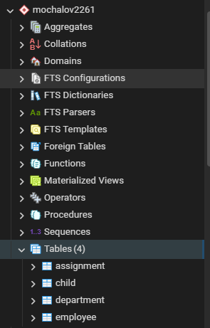
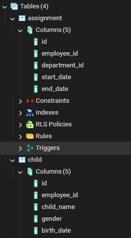
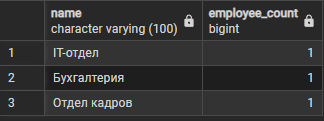
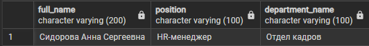
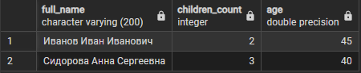
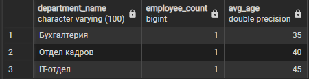
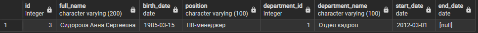
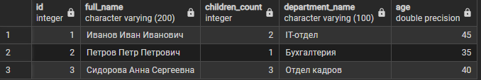
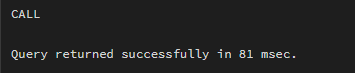

# Отчет по проектированию информационной модели для реляционной БД «Отдел кадров»

# Постановка задачи (Вариант 8)

### Цель проекта

Создать реляционную базу данных для учета сотрудников, их детей и истории работы сотрудников в различных отделах предприятия.

### Сущности

-   **Сотрудники**: табельный номер, ФИО, паспортные данные, адрес, дата рождения, пол, должность, количество детей.
-   **Дети сотрудников**: имя, пол, дата рождения.
-   **Отделы**: наименование, количество закреплённых помещений.
-   **Назначения (история работы)**: сотрудник → отдел, дата начала, дата окончания.

### Процессы

-   Каждый сотрудник работает только в одном отделе в каждый момент времени.
-   Необходимо вести полную хронологию назначений.
-   Даты периодов **не должны пересекаться** — требует реализации триггера.

### Выходные документы

1. Список работников заданного отдела на указанную дату, упорядоченный по возрасту.
2. Список сотрудников, имеющих более одного ребенка, сгруппированный по отделам, с подсчётом **среднего возраста сотрудников**.

## Содержание

1. [Постановка задачи](#постановка-задачи)
2. [Концептуальная модель (ER)](#концептуальная-модель-er)
3. [Логическая модель](#логическая-модель)
4. [Физическая модель](#физическая-модель)
5. [SQL DDL](#sql-ddl)
6. [Примеры запросов и выходных документов](#примеры-запросов-и-выходных-документов)
7. [Проверка нормальных форм](#проверка-нормальных-форм)
8. [Эволюция проекта](#эволюция-проекта)
9. [Итог](#итог)

# Лабораторная работа 1

## Концептуальная модель (ER)


## Описание сущностей

Сотрудник (Employee)

Представляет работника предприятия. Содержит основные персональные данные, должность и сведения о семье.

Ребёнок сотрудника (Child)

Отдельная сущность, описывающая детей сотрудников. Связана с конкретным сотрудником.

Отдел (Department)

Структурное подразделение предприятия. Имеет собственное название и характеристики (например, количество помещений).

Назначение (Assignment)

Отражает факт прикрепления сотрудника к определённому отделу на конкретный период времени. Используется для хранения полной хронологии работы сотрудников.

---

# Лабораторная работа 2

## Логическая модель


## Физическая модель


## SQL DDL

# Полный скрипт создания базы данных

```sql
CREATE TABLE IF NOT EXISTS department(
    id SERIAL PRIMARY KEY,
    name VARCHAR(100) UNIQUE,
    rooms INT
);

CREATE TABLE IF NOT EXISTS employee(
    id SERIAL PRIMARY KEY,
    full_name VARCHAR(200),
    passport VARCHAR(50),
    address VARCHAR(250),
    birth_date DATE,
    gender CHAR(1),
    position VARCHAR(100),
    children_count INT
);

CREATE TABLE IF NOT EXISTS child(
    id SERIAL PRIMARY KEY,
    employee_id INT REFERENCES employee(id),
    child_name VARCHAR(100),
    gender CHAR(1),
    birth_date DATE
);

CREATE TABLE IF NOT EXISTS assignment(
    id SERIAL PRIMARY KEY,
    employee_id INT REFERENCES employee(id),
    department_id INT REFERENCES department(id),
    start_date DATE,
    end_date DATE
);
```





# Заполнение таблиц данными

```sql
INSERT INTO department (name, rooms) VALUES
('Отдел кадров', 5),
('Бухгалтерия', 3),
('IT-отдел', 4);

INSERT INTO employee (full_name, passport, address, birth_date, gender, position, children_count) VALUES
('Иванов Иван Иванович', '1234 567890', 'г. Москва', '1980-01-01', 'M', 'Инженер', 2),
('Петров Петр Петрович', '4321 098765', 'г. Тверь', '1990-05-10', 'M', 'Бухгалтер', 1),
('Сидорова Анна Сергеевна', '5678 112233', 'г. Москва', '1985-03-15', 'F', 'HR-менеджер', 3);

INSERT INTO assignment (employee_id, department_id, start_date, end_date) VALUES
(1, 3, '2010-01-01', NULL),
(2, 2, '2015-02-01', NULL),
(3, 1, '2012-03-01', NULL);

```

1NF – все таблицы имеют первичные ключи, атрибуты атомарны
2NF – неключевые атрибуты полностью зависят от PK
3NF – транзитивные зависимости отсутствуют
4NF – многозначные зависимости отсутствуют
5NF – отсутствуют зависимости соединения

Вывод: таблицы находятся в нормальных формах до 5NF включительно.

# Создание дампа базы данных

```sql
pg_dump -U postgres -d database_name > department_dump.sql
```

# Выполнение содержательных SELECT-запросов

Запрос 1: сотрудники заданного отдела

```sql
SELECT e.id, e.full_name
FROM employee e
JOIN assignment a ON a.employee_id = e.id
JOIN department d ON d.id = a.department_id
WHERE d.name = 'Отдел кадров'
ORDER BY e.full_name;
```

Запрос 2: количество сотрудников по отделам

```sql
SELECT d.name, COUNT(e.id) AS employee_count
FROM department d
LEFT JOIN assignment a ON d.id = a.department_id
LEFT JOIN employee e ON e.id = a.employee_id
GROUP BY d.name
ORDER BY d.name;
```




# Лабораторная работа №3

## 1. Создание представлений для выходных документов

### Как Views оптимизируют запросы

Представления (Views) оптимизируют работу с базой данных следующими способами:

1. **Упрощение доступа к данным** — сложные SQL-запросы с JOIN скрыты за простым интерфейсом представления.
2. **Единая точка правки** — изменение логики запроса выполняется в одном месте.
3. **Оптимизация выполнения** — план выполнения запроса может кэшироваться СУБД, что ускоряет повторные обращения.

---

### Представление 1: Сотрудники по отделам

```sql
CREATE OR REPLACE VIEW employees_by_department AS
SELECT
    e.id,
    e.full_name,
    e.birth_date,
    e.position,
    d.id AS department_id,
    d.name AS department_name,
    a.start_date,
    a.end_date
FROM employee e
JOIN assignment a ON e.id = a.employee_id
JOIN department d ON d.id = a.department_id;
```

**Использование (упрощённый доступ):**

```sql
SELECT full_name, birth_date, position
FROM employees_by_department
WHERE department_name = 'Отдел кадров'
  AND start_date <= DATE '2024-01-01'
  AND (end_date IS NULL OR end_date >= DATE '2024-01-01')
ORDER BY birth_date;
```

**Результат использования:**



---

### Представление 2: Статистика сотрудников по детям

Оптимизация заключается в том, что вычисление возраста и связка с отделами скрыты внутри представления.

```sql
CREATE OR REPLACE VIEW employee_children_stats AS
SELECT
    e.id,
    e.full_name,
    e.children_count,
    d.name AS department_name,
    DATE_PART('year', AGE(e.birth_date)) AS age
FROM employee e
JOIN assignment a ON e.id = a.employee_id
JOIN department d ON d.id = a.department_id;
```

**Использование (быстрый доступ к статистике):**

```sql
SELECT full_name, children_count, age
FROM employee_children_stats
WHERE children_count > 1
ORDER BY department_name;
```

**Результат использования:**



---

## 2. Разработка хранимых процедур с параметрами

### Процедура 1: Добавление нового сотрудника

Инкапсуляция бизнес-логики добавления сотрудника в базу данных.

```sql
CREATE OR REPLACE PROCEDURE add_employee(
    p_full_name VARCHAR,
    p_passport VARCHAR,
    p_address VARCHAR,
    p_birth_date DATE,
    p_gender CHAR,
    p_position VARCHAR,
    p_children_count INT
)
LANGUAGE plpgsql
AS $$
BEGIN
    INSERT INTO employee
    (full_name, passport, address, birth_date, gender, position, children_count)
    VALUES
    (p_full_name, p_passport, p_address, p_birth_date, p_gender, p_position, p_children_count);
END;
$$;
```

---

### Процедура 2: Назначение сотрудника в отдел

Процедура фиксирует факт назначения сотрудника в отдел с указанием периода работы.

```sql
CREATE OR REPLACE PROCEDURE assign_employee(
    p_employee_id INT,
    p_department_id INT,
    p_start_date DATE,
    p_end_date DATE
)
LANGUAGE plpgsql
AS $$
BEGIN
    INSERT INTO assignment
    (employee_id, department_id, start_date, end_date)
    VALUES
    (p_employee_id, p_department_id, p_start_date, p_end_date);
END;
$$;
```

---

## 3. Представление сложных запросов при помощи представлений

### Сложное представление: Полная статистика по отделам

Объединение данных из нескольких таблиц и использование агрегатных функций.

```sql
CREATE OR REPLACE VIEW department_full_statistics AS
SELECT
    d.id,
    d.name AS department_name,
    COUNT(e.id) AS employee_count,
    AVG(DATE_PART('year', AGE(e.birth_date))) AS avg_age
FROM department d
JOIN assignment a ON d.id = a.department_id
JOIN employee e ON e.id = a.employee_id
GROUP BY d.id, d.name;
```

**Использование сложного представления:**

```sql
SELECT department_name, employee_count, avg_age
FROM department_full_statistics
ORDER BY employee_count DESC;
```

**Результат использования:**



---

## Проверка работы

### Проверка представлений

```sql
SELECT * FROM employees_by_department
WHERE department_id = 1
LIMIT 3;

SELECT * FROM employee_children_stats
LIMIT 3;
```

### Проверка процедур

```sql
CALL add_employee(
    'Новиков Иван Сергеевич',
    '9999 888888',
    'г. Москва',
    '1987-04-12',
    'M',
    'Инженер',
    2
);

CALL assign_employee(1, 2, '2024-02-01', NULL);
```

## Результаты выполнения

Результат использования представления employees_by_department: 

Результат использования представления employee_children_stats: 

Результат использования процедуры add_employee: 

Результат использования процедуры assign_employee: 

---

### Индексы

```sql
CREATE INDEX idx_emp_birth ON employee(birth_date);
CREATE INDEX idx_assign_emp ON assignment(employee_id);
CREATE INDEX idx_assign_dept ON assignment(department_id);
```

### Триггер предотвращающий пересечение периодов

```sql
CREATE OR REPLACE FUNCTION check_assignment_overlap()
RETURNS TRIGGER AS $$
BEGIN
    IF EXISTS (
        SELECT 1
        FROM assignment a
        WHERE a.employee_id = NEW.employee_id
          AND (NEW.end_date IS NULL OR a.start_date <= NEW.end_date)
          AND (a.end_date IS NULL OR a.end_date >= NEW.start_date)
          AND a.id <> NEW.id
    ) THEN
        RAISE EXCEPTION 'Пересечение периодов работы сотрудника';
    END IF;
    RETURN NEW;
END;
$$ LANGUAGE plpgsql;

CREATE TRIGGER trg_assignment_overlap
BEFORE INSERT OR UPDATE ON assignment
FOR EACH ROW EXECUTE FUNCTION check_assignment_overlap();
```

---

# Примеры запросов и выходных документов

## 1. Список работников отдела на дату

```sql
SELECT e.full_name,
       e.birth_date,
       e.position,
       d.name AS department
FROM employee e
JOIN assignment a ON a.employee_id = e.id
JOIN department d ON d.id = a.department_id
WHERE d.name = :dept_name
  AND a.start_date <= :the_date
  AND (a.end_date IS NULL OR a.end_date >= :the_date)
ORDER BY e.birth_date;
```

### Пример результата

| ФИО         | Дата рождения | Должность | Отдел   |
| ----------- | ------------- | --------- | ------- |
| Иванов И.И. | 1980-01-01    | инженер   | Отдел А |

---

## 2. Сотрудники с более чем одним ребёнком + средний возраст в отделе

```sql
SELECT d.name AS department,
       e.full_name,
       e.children_count,
       DATE_PART('year', AGE(e.birth_date)) AS age
FROM employee e
JOIN assignment a ON a.employee_id = e.id
JOIN department d ON d.id = a.department_id
WHERE e.children_count > 1
ORDER BY d.name;
```

### Средний возраст по отделам (view)

```sql
CREATE OR REPLACE VIEW dept_avg_age AS
SELECT d.name,
       AVG(DATE_PART('year', AGE(e.birth_date))) AS avg_age
FROM employee e
JOIN assignment a ON a.employee_id = e.id
JOIN department d ON d.id = a.department_id
GROUP BY d.name;
```

---

# Проверка нормальных форм

| НФ   | Статус | Комментарий                     |
| ---- | ------ | ------------------------------- |
| 1NF  | ✔      | Все атрибуты атомарны           |
| 2NF  | ✔      | Нет зависимостей от части ключа |
| 3NF  | ✔      | Нет транзитивных зависимостей   |
| BCNF | ✔      | Все детерминанты — ключи        |

---

# Эволюция проекта

### 1. Добавление триггера

Проблема пересечения периодов решена триггером `check_assignment_overlap()`.

### 2. Уточнение структуры детей

Ребёнок связан только FK → employee.

### 3. Выделение отделов в самостоятельную таблицу

Уникальность названия + учёт помещений.

### 4. Оптимизация запросов

Добавлены индексы по самым частым условиям фильтрации.

---

# Итог

Проект полностью реализует требования:

-   учёт сотрудников, детей, отделов;
-   хранение истории назначений без пересечений;
-   формирование требуемых отчётов;
-   нормализованная структура (BCNF);
-   оптимизация с помощью индексов и VIEW.
-   Данные были проверены при помощи валидации Deepseek, как и требовалось.

Последнее обновление: 2025-11-17
